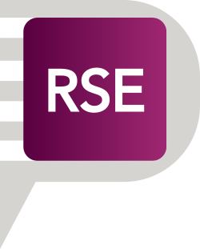

# Research Software Engineer Community <small>docs</small>

> Starter Pack for your RSE Community

- Definitions for Research Software Engineers
- Community Website Template
- Communication

[GitHub](https://github.com/usrse/community-template)
[Get Started](#rse-community-starter-pack)
